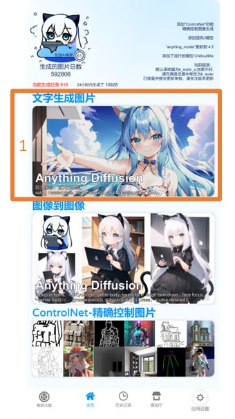
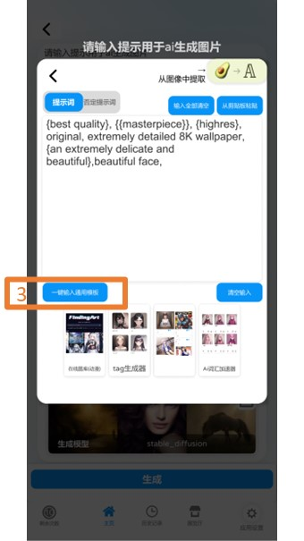
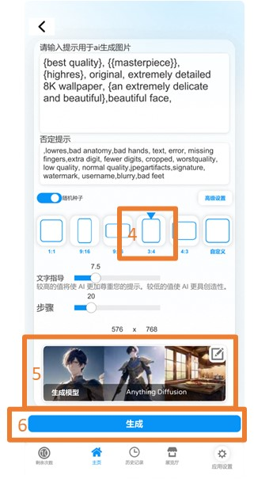
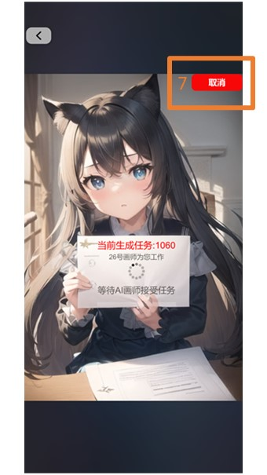
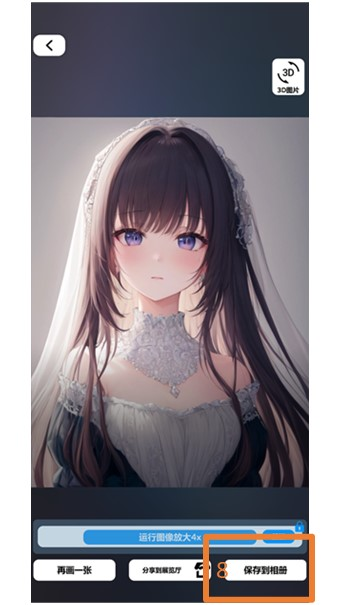

# 💡 文字生成圖片

## 快速開始

機畫師-快速使用教程（YouTuber-電腦王阿達）



<figure><figcaption>
點擊文字生成圖片
</figcaption></figure>

 

<figure><figcaption>
點擊文字輸入區域
</figcaption></figure>

 

<figure><figcaption>
點擊“一鍵輸入通用模板”
</figcaption></figure>

1. 點擊文字生成圖片
2. 點擊文字輸入區域
3. 點擊“一鍵輸入通用模板”（這是一個通用模板，在大多數情況下可以創建優質的圖片），可以根據需要增加或者修改提示詞

<figure><figcaption>
選擇生成圖片的尺寸 選擇生成模型 點擊“生成”按鈕開始圖片生成
</figcaption></figure>

 

<figure><figcaption>
這個是生成圖片的界面 會顯示當前任務狀態
</figcaption></figure>

 

<figure><figcaption>
這是生成完成的圖片
</figcaption></figure>

4. 選擇生成圖片的尺寸
5. 選擇生成模型（默認是 Anything Diffusion 擅長動漫風格的圖片）
6. 點擊“生成”按鈕開始圖片生成
7. 這個是生成圖片的界面，會顯示當前任務狀態，如果大於20s不接受任務，或者生成時間太長（大於100s）可以點擊取消
8. 這是生成完成的圖片，可以點擊“保存到相冊”保存到手機相冊
